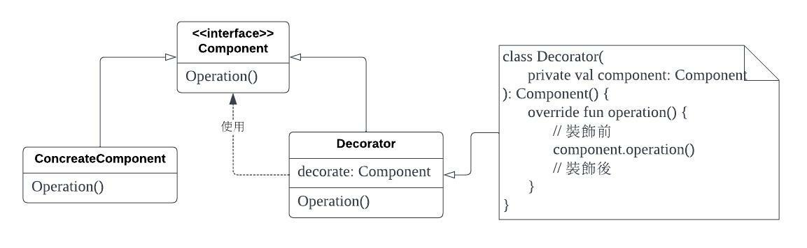

# 介入攔截

### 重點

* 兩個物件之間的呼叫攔截
* 何謂裝飾者模式
* 何謂橫切關注點

### 關於攔截(Interception)

攔截指的是一種可以介入兩個協作元件之間的呼叫行為，以此強化或改變依賴對象行為，但又不需要修改兩個協作元件本身內容的能力。


### 裝飾者模式

裝飾者模式其實就是攔截機制的一種實作，這個模式的用意在於「能夠動態地對物件賦予額外的職責，裝飾者模式提供了一種彈性的選擇，讓我們能進一步擴展功能」。



這種動態賦予能力代表可以在執行階段才決定是否要套用裝飾元件，而不是像類別繼承機制一樣，在編譯階段就將這層關係事先定義下來。

而且裝飾元件還可以再套裝飾元件，就像俄羅斯娃娃一樣，但最終還是要有一個的實體物件來處理實際功能。


裝飾者還可以除了裝飾前、後的行為，決定要不要將呼叫轉傳下去

```
fun operation(text: String){
    if(text.isEmpty()){
        return "Hello world!"
    }
    return this.decorate.operation(text。)
}
```

從上面的範例來說，嚴格來說其實不是裝飾者模式，而是責任鏈模式。因為選擇不呼叫更內層的元件，這樣的行為就不僅僅是「裝飾」而是「取代」了原本的行為。比較好的做法是要丟出一個例外。

#### 範例-紀錄API的參數


```
class ApiLoggerRepositoryDecorator(
    private val apiRepository: Repository,
    private val logger: Logger
): Repository{
    
    override fun login(account: String) {
        logger.log("log before")
        apiRepository.login(account)
        logger.log("log after")
    }
}
```


### 橫切關注點

「橫切關注點」指的是可能會牽涉到橫跨整個code base中很大一片區域的非功能性剖面需求。常見的需求如：稽核紀錄、程式紀錄、效能監控、驗證、錯誤處理等等。


從上圖來看會發現程式紀錄，會在使用者介面層、業務層、資料存取層使用。也就是說只是把同一段程式碼作為模板、不斷地套在某一個介面上而已。為了防止無止盡的複製貼上，就需要導入「剖面向程式設計(Aspect-Oriented Programming)」。

### 責任鏈模式


### 裝飾者模式 vs 責任鏈模式

### 參考

書籍為「依賴注入-原理、實作與設計模式」，中文版由博碩出版。P. 357。
